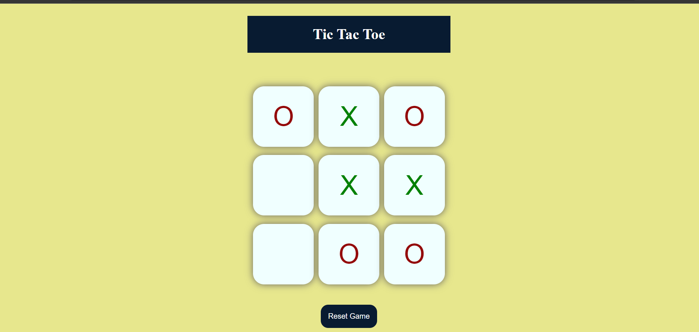
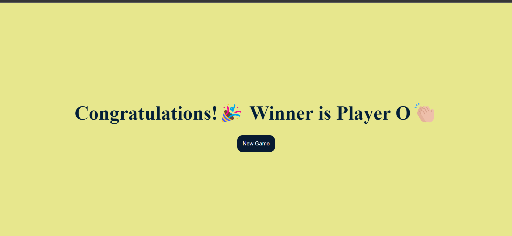

<h2 align ="center">Tic-tac-toe Game</h2>
<h3>Game Description:</h3>

Tic-tac-toe, noughts and crosses, or Xs and Os is a game between two players who take turns marking the spaces in a three-by-three grid with X or O. The player who succeeds in placing three of their marks in a horizontal, vertical, or diagonal row is the winner.

<h2>ScreenShots</h2>

### Game Screen
<table>
        <tr> 
        <td></td>
        </tr>
</table>

### Winner Screen

<table>
        <tr> 
        <td></td>
        </tr>
</table>

## Technologies Used:

- [x] **Frontend:** HTML, CSS
- [x] **Backend:** JavaScript 

